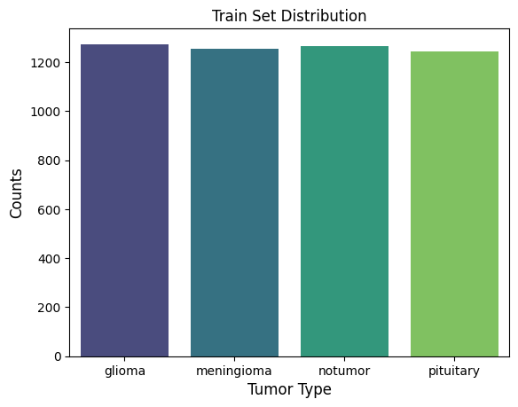
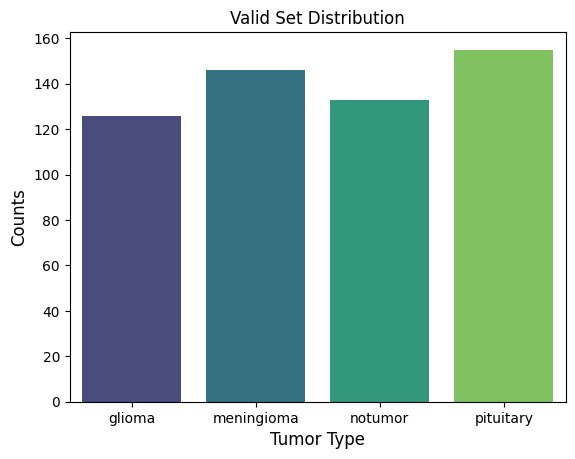
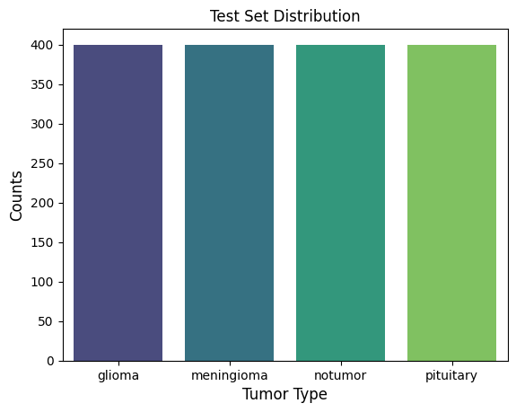

# Brain Tumor Classification with Explainable AI (Grad-CAM)

# Demo link: [Brain Tumor Classification](https://aibraintumordashboard.streamlit.app/)

## 1. Problem Statement
- A Brain tumor is considered as one of the aggressive diseases, among children and adults. Brain tumors account for 85 to 90 percent of all primary Central Nervous system (CNS) tumors. With manual examination, it can be error-prone due to the level of complexity. Hence, adding Machine Learning (ML) and Artificial intelligence (AI) has consistently shown higher accuracy than manual classification.

- The 5-year survival rate for people with cancerous brain or CNS tumor is approximately 34% for men and 36% for women. Brain tumors are classified as: Benign tumor, Malignant Tumor, Pituitary Tumor, etc. Proper treatment, planning, and accurate diagnostics should be implemented to improve the life expectanct of patients.

- The best technique to detect brain tumors is Magnetic Resonance Imaging (MRI). A huge amount of image data is generated through the scans. These images are examined by radiologists. A manual examination can be error-prone due to the level of complexities involved in brain tumors and their properties.

### Tech Stacks
- Deep Learning Framwork: [PyTorch](https://pytorch.org/), [Torchvision](https://docs.pytorch.org/vision/main/index.html)
- Medical Imaging: [MONAI](https://github.com/Project-MONAI/MONAI)
- Model Architectures: [DenseNet121](https://docs.pytorch.org/vision/main/models/generated/torchvision.models.densenet121.html)
- Exaplanable AI (XAI): [Grad-CAM](https://github.com/jacobgil/pytorch-grad-cam)
- Data Processing: [Pandas](https://en.wikipedia.org/wiki/PANDAS), [Scikit-learn](https://scikit-learn.org/stable/), [Numpy](https://numpy.org/)
- Visualization & Dashboard: [Matplotlib](https://matplotlib.org/), [Seaborn](https://seaborn.pydata.org/), [Streamlit](https://streamlit.io/)

### Explainable AI
- With the use of [Grad-CAM](https://github.com/jacobgil/pytorch-grad-cam) which utilizes gradients to indicate which regions of an image that most influence the model's decision.

## 2. Data Source:
- Dataset: [Brain Tumor Classification MRI](https://www.kaggle.com/datasets/masoudnickparvar/brain-tumor-mri-dataset) - updated recently on Feb/2026, reflected more balanced distribution in 4 types of tumors' images in the dataset

- Description: This dataset contains 7,200 images of brain MRI which are classified into 4 classes: no tumor, glioma, meningioma, and pituitary tumor.

## 3. Project Structure
- data_utiles.py: Contains MONAI-based preprocessing pipeline and medical image augmentation
- models.py: Defined 1-layer, 6-layer, Resnet18 and VGG16 architectures adapted for 1-channel MRI in put
- *utils.py*: Implementation of Grad-CAM for explainability 
- app.py: Deploy code with Streamlit app

- Splitting training dataset into training and validation with ratio of 9:1 

| Training Set | Validation Set | Testing Set |
| :---: | :---: | :---: |
|  |  |  |

## 4. Potential Impact
**Time and Cost Reduction in Healthcare**: facilitates early detection of brain tumors and diagnosis, helps reduce patients' waiting time and save doctors from burn-out.

**Assist doctors in treatment planning**: produces sencond opinion in a time-ly manner can alert the doctors during the treatment planning process and speed uo workflow efficiency

**Better performance Overall**:  When analyzing MRI, there must be a radiologist and a neurosurgeon on-site, hence, an automated system on Cloud can add a valuable second opinion in a timely manner

### How to Run:
- Make sure you have PyTorch, Grad-CAM, MONAI libraries downloaded and other dependencies ready!

- Follow the steps outlined in the notebook, from data loading to model evaluation. After the first few tries, feel free to experiment different parameters. 

## Model Accuracy Results:
In this project, we experienced 2 different models with increasing complexities to see how the accuracy is improved over time:
1. 6 layers of CNN

| Type of Tumor | Precision | Recall | F1-Score |
| --- | --- | --- | --- |
| Glioma | 97% | 75% | 85% |
| Meningioma| 87% | 95% | 90% |
| No Tumor | 88% | 100% | 94% |
| Pituitary | 97% | 98% | 98% |

**Evaluation**: 
- This 6-layered model is doing excellent in identifying no tumor with **100% score of recall**, which means that the model has been overfitting and learning a little too well.
It has **lower precision - 88%**, which means that it sometimes misclassifies other classes as no tumor - which is the error that we want to minimize mostly since identifying a sick patient with tumor as healthy is ultimately dangerous!
- On the other hand, it's also missing out on roughly 25% of the image in glioma class. This is also a critical area for improvement since misclassifying glioma - either as `no tumor` or other types of tumor, may lead to significant consequences.

2. DenseNet121

| Type of Tumor | Precision | Recall | F1-Score |
| --- | --- | --- | --- |
| Glioma | 98% | 78% | 87% |
| Meningioma| 89% | 91% | 90% |
| No Tumor | 86% | 98% | 92% |
| Pituitary | 95% | 98% | 96% |

 **Evaluation**:
- Glioma: The model shows high precision (0.98), meaning when it predicts 'glioma', it's usually correct. However, its recall (0.78) is a bit lower, indicating it missed identifying some actual 'glioma' cases.
- Meningioma: The model performs well with 0.89 precision and 0.91 recall.
- No Tumor: This class has really good recall (0.98), meaning most 'no tumor' cases are correctly identified, but slightly lower precision (0.86), indicating it sometimes misclassifies other tumor types as 'no tumor'. The F1-score is 0.92.
- Pituitary: The model performs very well on this class, with high precision (0.95) and recall (0.98).
  
Overall, both models achieved an accuracy on the test set with 92%. While the 6-layered model demonstrate "specialist" behaviour in overfitting on healthy scans, it might potentially misclassifies actual tumors - very risky in real-life situations, the DenseNet121 model is generalizing better between 4 types of tumors instead of specializing in only 1 type.

## Usage
- The future website/app is intended to classify MRI brain tumor into 4 clasess: no tumor, glioma, meningioma and pituitary.
- This website/app should be used as an add-on and shouldn't be considered as professional diagnosis. The main advantage is to give a second opinion in a timely manner

## Next Steps for Model Improvement
To further enhance the performance and capabilities as well as practicality of the CNN model, the following steps are recommended:
1. Model refinement
- Data input: The more data coming in, the better the model will be trained and learn different patterns of MRI. Currently, the model is being trained on a limited dataset, hence, the performance will somehow be limited
- Hyperparameter tuning: higher epochs don't necessary guarantee better performance, looking into playing with batch sizes, learning rates, etc. might give better performance

2. Implement Transfer Learning:
- In this project, we touch base of Transfer Learning with DenseNet121. Feel free to experience with other Resnet architectures such as Resnet50, VGG19, etc.

  
## Citation
misc{msoud_nickparvar_2026,
	title={Brain Tumor MRI Dataset},
	url={https://www.kaggle.com/dsv/14832123},
	DOI={10.34740/KAGGLE/DSV/14832123},
	publisher={Kaggle},
	author={Msoud Nickparvar},
	year={2026}
}

